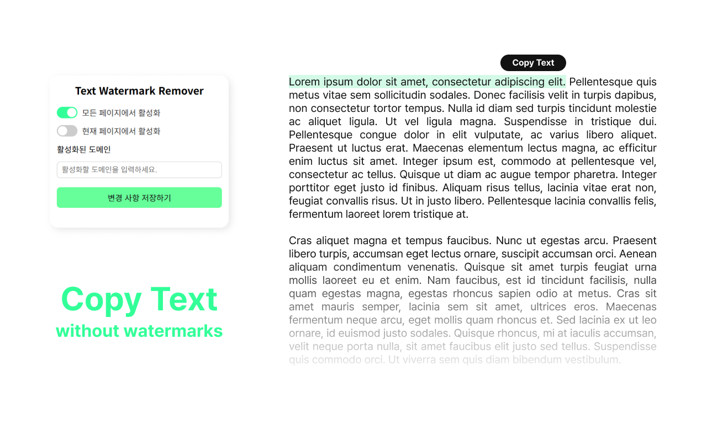

# Text Watermark Remover

Text Watermark Remover is a Chrome extension that removes hidden watermark characters from copied text on web pages.

## Features

- Intercepts clipboard operations (`navigator.clipboard.writeText`, `navigator.clipboard.write`) and `document.execCommand('copy')`
- Removes watermark characters: U+200B, U+200C, U+200D, U+2060, U+FEFF, U+202F, U+00A0

## Installation

1. Clone or download the repository to a local directory.
2. Open Chrome and navigate to `chrome://extensions`.
3. Enable **Developer mode**.
4. Click **Load unpacked** and select the extension directory.

## Configuration

- **manifest.json**
  - `content_scripts.run_at`: set to `document_start` to override clipboard APIs early
  - `web_accessible_resources`: include `inject.js` for page injection
  - Permissions: `scripting`, and host permissions for target domains

## Development

- Modify `inject.js` or `content.js` as needed.
- Reload the extension in `chrome://extensions`.
- Reload target web pages to apply changes.
